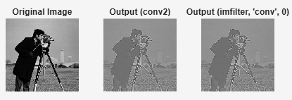

## MATLAB Image Filtering Comparison: `conv2` vs. `imfilter` (Convolution)

This repository contains a MATLAB script that verifies the **mathematical equivalence** between the two primary 2D convolution functions in MATLAB, `conv2` and `imfilter`, when the output size and boundary conditions are properly controlled.

### Key Findings

The script confirms that $\text{conv2}(\dots, \text{'same'})$ is equivalent to $\text{imfilter}(\dots, \text{0}, \text{'same'}, \text{'conv'})$, demonstrating that for identical outputs, $\text{imfilter}$ must be explicitly set to perform **convolution** and use **zero-padding** ($\text{0}$).

| Function | Operation | Size | Boundary Padding | Configuration |
| :--- | :--- | :--- | :--- | :--- |
| **`conv2`** | Convolution (Default) | Same (`'same'`) | Zero-Padding (Implicit) | `conv2(I, H, 'same')` |
| **`imfilter`** | Convolution (`'conv'`) | Same (`'same'`) | Zero-Padding (`0`) | `imfilter(I, H, 0, 'same', 'conv')` |

### MATLAB Script (`Compare_conv2_imfilter.m`)

```matlab
close all; clear; clc;
% --- Setup: Load Image and Define Filter ---
I = imread('cameraman.tif'); % Load a standard grayscale image
I = im2double(I);            % Convert to double for floating-point math
% Define a convolution kernel (a 3x3 sharpening filter)
H = [0 -1 0; -1 5 -1; 0 -1 0];
% --- 1. Convolution using conv2 (Implies Zero-Padding) ---
Output_conv2 = conv2(I, H, 'same');
% --- 2. Convolution using imfilter (Explicitly set to conv and zero-padding) ---
Output_imfilter_zero = imfilter(I, H, 0, 'same', 'conv'); 
% --- 3. Calculate Difference ---
Max_Diff = max(abs(Output_conv2(:) - Output_imfilter_zero(:)));
% --- 4. Display Results ---
fprintf('Maximum absolute difference (conv2 vs imfilter with zero-padding): %g\n', Max_Diff);
figure;
subplot(1, 3, 1); imshow(I, []); title('Original Image');
subplot(1, 3, 2); imshow(Output_conv2, []); title('Output (conv2)');
subplot(1, 3, 3); imshow(Output_imfilter_zero, []); title('Output (imfilter, ''conv'', 0)');
```

### Verification

The script proves equivalence by calculating the maximum absolute difference between the two outputs, which results in a value near machine precision (e.g., $\mathbf{10^{-15}}$ to $\mathbf{10^{-16}}$):

```
Maximum absolute difference (conv2 vs imfilter with zero-padding): [A number around 1e-15]
```

The generated figure visually confirms this result, as the two filtered images are identical.


